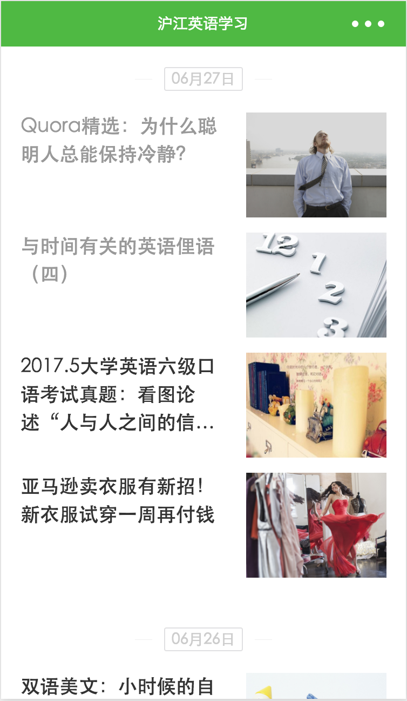

## 搭建页面结构

## 首先

首先我们要做的是什么呢？直接写页面结构吗？不是，给用户以良好的提示是很重要的，所以，我们要做的第一件事就是，加载中...

那我们在前面其实已经写好了加载的组件，所以现在就可以直接拿来用了。

对于 `wxml`:

```html
<include src="../component/loading/loading.wxml"/>
```

`include` 相当于将代码块复制粘贴过来，`import` 相当于调用，它有自己的作用域。

> **注意**：include 和 import 的区别，[官方 API-引用](https://mp.weixin.qq.com/debug/wxadoc/dev/framework/view/wxml/import.html)

## 分析页面结构

然后，我们来看看我们需要的最终效果是什么样的：



通过分析设计稿可以看出，这个列表是按照**天**为单位来分段，在每天的文章里又按照**文章**为单位继续细分。所以可以知道这个 `wxml` 的主体结构是循环套循环。所以我们可以初步写出下面的结构：

```html
<include src="../component/loading/loading.wxml"/>
<view wx:for="{{ articleList }}" wx:for-item="group" wx:key="{{ group.date }}">
	<view wx:for="{{ group }}" wx:for-item="item" wx:key="{{ item.contentId }}"></view>
</view>
```

这里有一点需要**注意**：在 `wxml` 做循环嵌套的时候，一定要重新定义 `wx:for-item` 字段。因为 `wxml` 循环中当前项的下标变量名默认为 `index`，当前项的变量名默认为 `item`。如果没有重新定义 `item`，在内层循环里通过 `item` 取到的值其实是外层循环的值。

> [官方 API - 列表渲染](https://mp.weixin.qq.com/debug/wxadoc/dev/framework/view/wxml/list.html)

下面我们就详细的分析下具体的结构，首先，每一天都有一个日期做开头，然后下面是一天的 4 篇文章。每篇文章分为左右结构，左边是标题，最多 3 行，超过的文字就用 … 表示。右边是一张文章的封面图，如果没有封面图就用默认的封面图。上面的日期如果是今天就显示今天，否则就直接显示月日，所以可以把 `wxml` 结构丰富成下面的样子：

```html
<include src="../component/loading/loading.wxml"/>
<!--repeat-->
<view wx:for="{{ articleList }}" wx:for-item="group" wx:key="{{ group.date }}" class="group">
  <view class="group-bar">
  	<view class="group-title {{ group.formateDate === '今日' ? 'on' : ''}}">{{ group.formateDate }}</view>
  </view>
	<view wx:for="{{ group }}" wx:for-item="item" wx:key="{{ item.contentId }}">
  		<!--repeat-->
    	<view wx:for="{{ group.articles }}" wx:for-item="item" wx:key="{{ item.contentId }}" class="group-content-item">
          <view class="group-content-item-desc ellipsis-multi-line ellipsis-line-3">{{ item.title }}</view>
          <image mode="aspectFill" class="group-content-item-img" src="{{ item.cover || defaultImg.coverImg }}" ></image>
      </view>
  </view>
</view>
```

这里有一个图片处理的属性可以看看相应的 API 了解下：

> [官方 API - 图片处理](https://mp.weixin.qq.com/debug/wxadoc/dev/component/image.html)

接下来，我们就可以根据我们定好的类名给它们加上相应的样式，具体样式该怎么写我这里就不详细展开了，写完之后的样式是这样的：

```css
.wrapper .group {
  padding: 0 36rpx 10rpx 36rpx;
  background: #fff;
  margin-bottom: 16rpx
}

.wrapper .group-bar {
  height: 114rpx;
  text-align: center
}

.wrapper .group-title {
  position: relative;
  display: inline-block;
  padding: 0 12rpx;
  height: 40rpx;
  line-height: 40rpx;
  border-radius: 4rpx;
  border: solid 1rpx #e0e0e2;
  font-size: 28rpx;
  color: #ccc;
  margin-top: 38rpx;
  overflow: visible
}

.wrapper .group-title:after,.wrapper .group-title:before {
  content: '';
  top: 18rpx;
  position: absolute;
  width: 32rpx;
  height: 1rpx;
  transform: scaleY(.5);
  border-bottom: solid 1px #efefef
}

.wrapper .group-title:before {
  left: -56rpx
}

.wrapper .group-title:after {
  right: -56rpx
}

.wrapper .group-title.on {
  border: solid 1rpx #ffc60e;
  color: #ffc60e
}

.wrapper .group-title.on:after,.wrapper .group-title.on:before {
  border-bottom: solid 1px #ffc60e
}

.wrapper .group-content-item {
  position: relative;
  width: 100%;
  height: 194rpx;
  margin-bottom: 28rpx
}

.wrapper .group-content-item-desc {
  font-size: 36rpx;
  font-weight: 500;
  height: 156rpx;
  line-height: 52rpx;
  margin-right: 300rpx;
  margin-top: 8rpx;
  overflow: hidden;
  color: #333
}

.wrapper .group-content-item-img {
  position: absolute;
  right: 0;
  top: 0;
  vertical-align: top;
  width: 260rpx;
  height: 194rpx
}

.wrapper .group-content-item.visited .group-content-item-desc {
  color: #999
}

.wrapper .no-more {
  height: 44rpx;
  line-height: 44rpx;
  font-size: 32rpx;
  color: #ccc;
  text-align: center;
  padding: 20rpx 0
}
```

页面结构搭建完了吗？并没有，还有一件很重要的事情要做，对，我们需要分析下用户的交互，可以想到，所有的文章都应该是可点击的，所以我们需要给它们绑定点击事件，然后，我们有一个需求是用户点过的文章，标题需要变灰。所以在点击事件里我们需要做点击记录。当我们的所有内容都被读完了，我们要友好的告诉用户，所以需要在最底端加上一个提示，把这些交互考虑进去之后的 `wxml` 就是下面这样的：

```html
<!--index.wxml-->
<include src="../component/loading/loading.wxml"/>
<view class="wrapper">
    <!--repeat-->
    <view wx:for="{{ articleList }}" wx:for-item="group" wx:key="{{ group.date }}" class="group">
        <view class="group-bar">
            <view class="group-title {{ group.formateDate === '今日' ? 'on' : ''}}">{{ group.formateDate }}</view>
        </view>
        <view class="group-content">
            <!--repeat-->
            <view wx:for="{{ group.articles }}" wx:for-item="item" wx:key="{{ item.contentId }}" data-item="{{ item }}" bindtap="showDetail" class="group-content-item {{ item.hasVisited ? 'visited' : '' }}">
                <view class="group-content-item-desc ellipsis-multi-line ellipsis-line-3">{{ item.title }}</view>
                <image mode="aspectFill" class="group-content-item-img" src="{{ item.cover || defaultImg.coverImg }}" ></image>
            </view>
        </view>
    </view>

    <view hidden="{{ hasMore }}" class="no-more">暂时没有更多内容</view>
</view>
```

到此，页面搭建可以说是告一段落了，下一节带大家一起写逻辑。