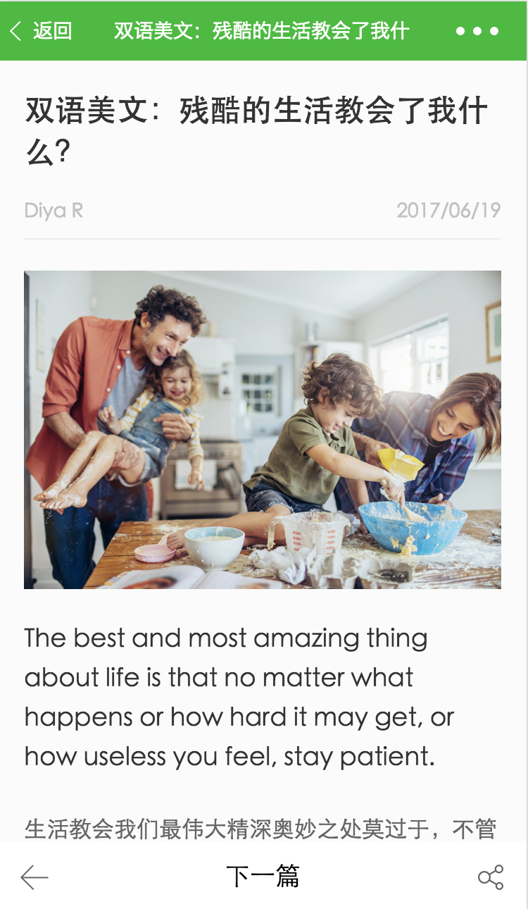

<h2 align="center"> 🇨🇳 微信小程序课程，面向所有具备前端基础知识的同学 🇨🇳 </h2>  

*吃葡萄不吐葡萄皮* 

&nbsp;

&nbsp;

&nbsp;

&nbsp;

&nbsp;

&nbsp;

&nbsp;

&nbsp;
 

## <a>&sect; 阅读要求</a>
> 读者需要具备但不限于以下技能
- HTML
- JavaScript `es6更佳`
- CSS

一共四章十五节，适合五天的训练营。  
从现在开始，我假装你已经掌握了 `html`、 `css`以及 `ES6`  ☝️ 

## <a>&sect; 目标导向</a>
> 本教程以实战项目驱动，最终实现一个完整的小程序

列表页面：请求接口，并展示列表页面数据

  
 
  

详情页面：以文章id为参数，获取文章详情 

  
 
  

 详情页面，点击图片，展示大图
 

  
 

 
 详情页面，点击英文单词，查词典功能
 

  
 

## <a>&sect; 教程大纲</a> 
-  第一章：微信小程序起步--Hello World
   - [appID准备](./docs/ch1-2.md)
   - [脚手架起步](./docs/ch1-3.md)
   - [Hello World](./docs/ch1-4.md)
   - [结构目录说明](./docs/ch1-5.md)
- 第二章：列表页面开发
   - [路由配置](./docs/ch2-1.md)
   - [列表页面制作](./docs/ch2-2.md)
   - [事件绑定](./docs/ch2-3.md)
   - [数据请求](./docs/ch2-4.md)
- 第三章：详情页面开发
   - [详情页面制作](./docs/ch3-1.md)
   - [数据请求处理](./docs/ch3-2.md)
   - [模板应用](./docs/ch3-3.md)
   - [实现图片展示功能](./docs/ch3-4.md)
   - [实现字典功能](./docs/ch3-5.md)
- 第四章：进阶提升
   - [parse-html 讲解](./docs/ch4-1.md)
   - [待定内容](./docs/ch4-2.md)

*所有章节项目皆以分支管理，学员可根据情况切换源码*

:clap: :clap: :clap: 实战即为以上随堂项目内容

## <a>&sect; 核心人员</a> 
<table>
  <tbody>
    <tr>
      <td align="center" valign="top">
        
         
        <a href="https://github.com/pavelShen">pavelShen</a>
        

        

      </td>
      <td align="center" valign="top">
        
         
        <a href="https://github.com/pangz1">pangz1</a>
        

        

      </td>
      <td align="center" valign="top">
        
         
        <a href="https://github.com/tinyuen">tinyuen</a>
        

        

      </td>
      <td align="center" valign="top">
        
         
        <a href="https://github.com/roeis">roeis</a>
        

        

      </td>
      <td align="center" valign="top">
        
         
        <a href="https://github.com/brucecham">brucecham</a>
        

        

      </td>
     </tr>
  </tbody>
</table>
